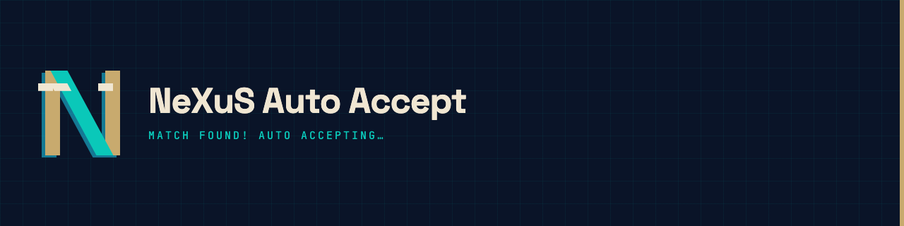
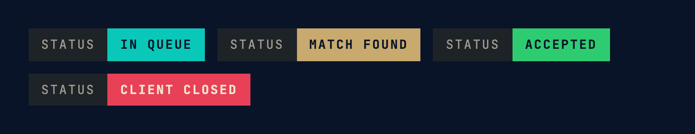

# Auto-Accept-LoL

[](https://github.com/sgtNeXuS/Auto-Accept-LoL/actions/workflows/release.yml)
[](https://github.com/sgtNeXuS/Auto-Accept-LoL/releases/latest)
[](LICENSE)

A background helper for League of Legends: it watches the League client and
automatically accepts ready checks the instant a match is found, so you
never miss one by tabbing away.

## Download

**[Download the latest Windows .exe](https://github.com/sgtNeXuS/Auto-Accept-LoL/releases/latest)**
— no install, no Python required. Just run it.

## What it does

- Detects the League client automatically (no setup, no login needed)
- Accepts ready checks and verifies the accept actually registered, retrying
  immediately if it didn't (rather than guessing with a fixed delay)
- Plays a sound and shows a desktop notification when a match is found
- Shows queue status, champ select, and in-game state
- Detects companion apps you have running (Blitz, Mobalytics, Porofessor, U.GG)
- Settings (sound, notifications, launch on startup) persist between runs



## Running it

There are two versions of the app:

- `nexus_gui.py` - the GUI (recommended). Dark-themed window with status,
  activity log, and a pause button.
- `nexus_magic.py` - the original console version, if you prefer a terminal.

```
pip install -r requirements.txt
python nexus_gui.py
```

On macOS you need a Python built with a modern Tk (the stock system Python's
Tk is too old and will crash on recent macOS). Use Homebrew:

```
brew install python-tk@3.12
python3.12 -m venv .venv
source .venv/bin/activate
pip install -r requirements.txt
python nexus_gui.py
```

## Building a standalone .exe

```
python build.py            # builds the windowed GUI app
python build.py --console  # builds the original console app
```

This regenerates `NeXusMagic.ico` from `NeXusMagic.png` and produces
`dist/NeXuS_Auto_Accept.exe` via PyInstaller. PyInstaller only builds for the
OS it's running on, so this has to be run on Windows to produce a Windows
exe - which is also why the release above is built by
[GitHub Actions](.github/workflows/release.yml) on a Windows runner rather
than committed by hand. Pushing a tag like `v1.0.1` builds and publishes a
new release automatically.

## Notes

- "Pause Auto-Accept" stops it from clicking accept for you but keeps
  watching your queue status - useful if you want to see match-found
  notifications without losing manual control.
- "Launch on Windows startup" only applies on Windows (adds a registry Run
  key); it's a no-op elsewhere.
